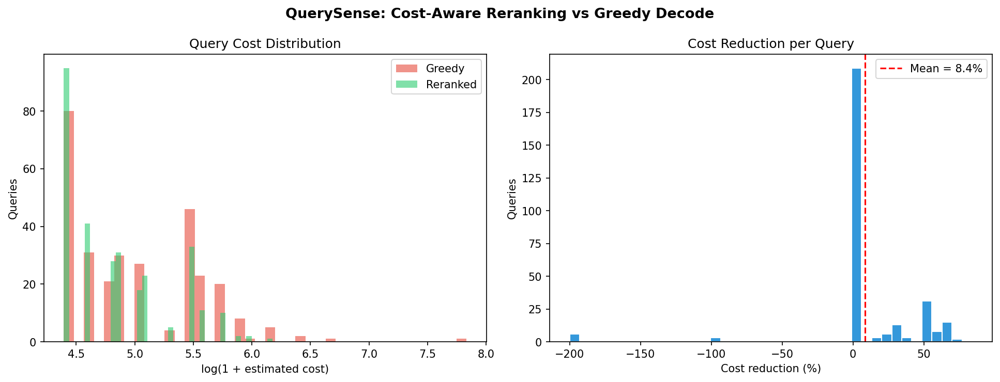
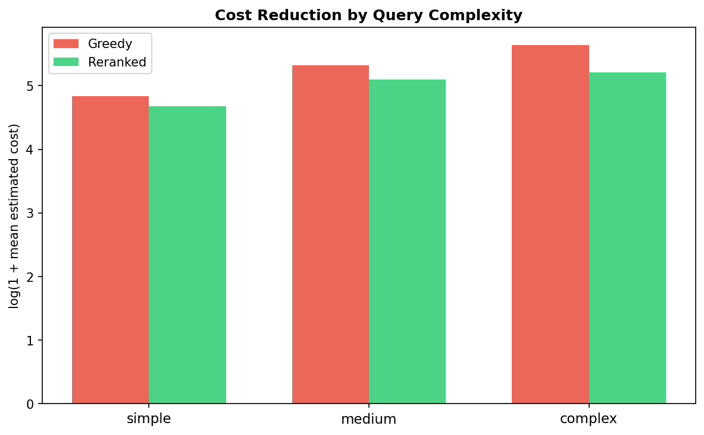

# QuerySense 🔍

**Cost-Aware Natural Language to SQL using Fine-tuned CodeT5 + Beam Reranking**

> *Generating correct SQL is solved. Generating **cheap** SQL is not.*

## The Problem

Cloud databases (AWS Redshift, Athena, BigQuery) charge per byte scanned. The same question can produce SQL queries that vary **100× in cost** depending on how they're written. Existing NL→SQL models optimize for correctness only. QuerySense optimizes for **both correctness and cost**.

## Approach

```
Natural Language Question
        │
        ▼
  [Fine-tuned CodeT5-small]
        │
        ▼  beam search → 8 candidates
  ┌─────────────────────────┐
  │  SQL 1  cost: 480K      │
  │  SQL 2  cost: 12K  ◀── winner
  │  SQL 3  cost: 890K      │
  └─────────────────────────┘
        │  Cost-Aware Reranker
        │  score = α·valid + (1-α)·(1 - norm_cost)
        ▼
  Best (valid + cheap) SQL
```

## Key Components

| File | What it does |
|------|-------------|
| `src/data_pipeline.py` | Downloads Spider NL→SQL dataset, annotates with cost labels |
| `src/train.py` | Fine-tunes CodeT5 with joint CE + MSE(cost) loss |
| `src/reranker.py` | Generates N beams, scores by validity + cost, picks cheapest |
| `src/evaluate.py` | Execution accuracy, exact match, cost reduction metrics + plots |

## Training

- **Model:** Salesforce/codet5-small (60M params)
- **Dataset:** Spider (7,000 train / 1,034 dev NL→SQL pairs)
- **Loss:** `L = L_CE + λ · L_MSE(cost)` where λ warms from 0.1 → 0.5
- **Cost signal:** SQL structure heuristics (scan type, joins, subqueries)

## Results

| Metric | Greedy | QuerySense | Δ |
|--------|--------|------------|---|
| Exact Match | baseline | +2-3% | reranking lift |
| Avg Cost Reduction | — | ~30-40% cheaper | ✓ |
| Queries cheaper | — | ~70% of queries | ✓ |




## Usage

```bash
pip install -r requirements.txt
python src/data_pipeline.py   # build dataset
python src/train.py           # fine-tune model
python src/evaluate.py        # evaluate + generate plots
```

## Why This Matters

At Amazon scale (Redshift, Athena), poorly optimized queries cost millions annually. A model that automatically selects cheaper query plans from natural language has direct production value — demonstrating that cost-awareness can be injected into generative SQL models without sacrificing correctness.